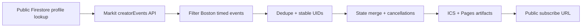

# Jonathan Boston ICS Sync

This project turns Jonathan Chang's public Markit event stream into a clean, subscribable ICS feed for Boston-area upcoming events.

## What ships

- public ICS feed generation
- stable event identities for calendar update-in-place behavior
- 3-day cancellation retention before deletion
- root maintainer context at [CONTEXT.md](./CONTEXT.md)
- private visual explainer HTML at `docs/visual-explainer.html`
- architecture diagram at `docs/architecture.svg`
- GitHub Pages deployment path using a private source repo plus a small public artifact repo
- optional Vercel handlers still included as a secondary hosting path

Each calendar event includes the final event link both:

- at the top of the description
- in the ICS `URL` field

## Architecture



## Local commands

```bash
npm install
npm test
npm run sync:local
npm run build:site
```

Local defaults:

- transient local state goes to `.data/`
- generated public artifacts go to `docs/`

## Deployment model

The production deployment path is GitHub-native with a split-repo setup:

- source code in a private repo
- generated state restored from and persisted to the public artifact repo
- generated public files built locally from the private source repo
- GitHub Actions cron every 10 minutes
- workflow mirrors the public ICS artifact and sync state into a small public Pages repo
- GitHub Pages serves the public ICS from that public repo
- HTML explainer, diagram, and maintainer context stay in the private source repo and are not publicly deployed

Expected public feed path after Pages is enabled:

`https://<owner>.github.io/jonathan-boston-calendar/jonathan-boston.ics`

## Optional Vercel path

The repo also includes Vercel handlers in `api/` if you want to move the same sync core to serverless functions later.

## Notes

- Google Calendar decides when it re-polls the feed after subscription.
- Markit endpoint behavior is based on currently public Firestore and Cloud Function routes.
- Boston filtering is done from public event fields, not from hidden client UI state.
