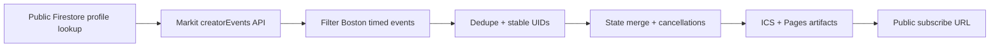

# ics_sync

This project regenerates subscribable ICS feeds from public event sources.

Current supported feeds:

- `https://lrdoc.github.io/ics_sync/jonathan-boston.ics`
- `https://lrdoc.github.io/ics_sync/movie-releases.ics` — upcoming movie release dates (TMDB); AMC "tickets on sale" alerts pending AMC key activation (see below)

## What ships

- public ICS feed generation
- stable event identities for calendar update-in-place behavior
- 3-day cancellation retention before deletion
- root maintainer context at [CONTEXT.md](./CONTEXT.md)
- private visual explainer HTML at `docs/visual-explainer.html`
- architecture diagram at `docs/architecture.svg`
- GitHub Pages deployment path from the same `ics_sync` repository
- optional Vercel handlers still included as a secondary hosting path

Each calendar event includes the final event link both:

- at the top of the description
- in the ICS `URL` field
- plus start, end, location, source profile, source event ID, and any available category/type metadata in the calendar notes

## Architecture



## Local commands

```bash
npm install
npm test
npm run sync:local
npm run build:site

# Movie release feed
npm run sync:movies
npm run build:movies
npm run resolve:amc-theatres -- "AMC Boston Common 19" "AMC Assembly Row 12"
```

Local defaults:

- transient local state goes to `.data/`
- generated public artifacts go to `docs/`

## Deployment model

The production deployment path is GitHub-native and uses a single repository:

- source code in `main`
- generated state restored from and persisted to `gh-pages`
- generated public files built locally from the same repository
- GitHub Actions cron every 10 minutes
- workflow publishes only the public ICS artifact and sync state to the `gh-pages` branch
- GitHub Pages serves the public ICS from that same repository
- HTML explainer, diagram, and maintainer context stay on `main` and are not part of the Pages branch

Expected public feed path after Pages is enabled:

`https://<owner>.github.io/ics_sync/jonathan-boston.ics`

## Multi-feed path

This repo supports multiple feeds under the same Pages site. The URL shape is:

`https://<owner>.github.io/ics_sync/<feed-name>.ics`

Each feed is a separate sync invocation with its own `FEED_NAME`/`CALENDAR_NAME` and source config, keeps its state in `state/state/<feed-name>.json`, and publishes as `docs/<feed-name>.ics`. The GitHub Actions workflow runs one sync+build pass per feed, and the publish step already picks up every `docs/*.ics` and `state/state/*.json` file generically, so adding a feed only means adding its sync+build steps — `movie-releases` (below) is the first example of this.

## Movie release feed

`movie-releases.ics` combines two sources behind the same normalization pipeline as Markit:

- **TMDB** (`src/sources/tmdb.js`) — upcoming US theatrical releases within `MOVIE_LOOKAHEAD_DAYS`, rendered as all-day "in theatres" events with Movie/Runtime/Director/Genre/Rating/synopsis in the description.
- **AMC** (`src/sources/amc.js`) — official catalog API (`developers.amctheatres.com`), tracking AMC Boston Common 19 and AMC Assembly Row 12. A movie's first-observed AMC showtime at one of those theatres fires a one-time "tickets on sale" alert (labeled "Thu preview" when the earliest showtime falls on a Thursday). Orchestration lives in `src/movieSync.js`, which persists a per-theatre "already alerted" baseline so a movie already on sale before the feed's first-ever run does **not** flood the calendar with a backlog of alerts, and so a stable on-sale movie never re-fires on later syncs.
- AMC status: endpoints are confirmed live and correctly authenticated against (verified via real 403/400 responses, not 404s). The vendor key itself is pending AMC's weekly Thursday production deploy. Once active: run the `Resolve AMC Theatre IDs` workflow, set the two ids as the `AMC_THEATRE_IDS` repo variable, and alerts start on the next scheduled sync.

## Optional Vercel path

The repo also includes Vercel handlers in `api/` if you want to move the same sync core to serverless functions later.

## Notes

- Google Calendar decides when it re-polls the feed after subscription.
- Markit endpoint behavior is based on currently public Firestore and Cloud Function routes.
- Boston filtering is done from public event fields, not from hidden client UI state.
- Subscribers only ever read the generated `.ics`/JSON state, so the number of calendar subscribers has no effect on TMDB/AMC call volume — that volume is bounded solely by the cron cadence.
