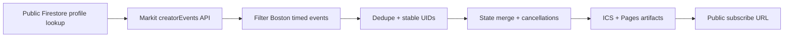

# Jonathan Boston ICS Sync

This project turns Jonathan Chang's public Markit event stream into a clean, subscribable ICS feed for Boston-area upcoming events.

## What ships

- public ICS feed generation
- stable event identities for calendar update-in-place behavior
- 3-day cancellation retention before deletion
- root maintainer context at [CONTEXT.md](./CONTEXT.md)
- private visual explainer HTML at `docs/visual-explainer.html`
- architecture diagram at `docs/architecture.svg`
- GitHub Pages deployment path from the same `ics_sync` repository
- optional Vercel handlers still included as a secondary hosting path

Each calendar event includes the final event link both:

- at the top of the description
- in the ICS `URL` field
- plus start, end, location, source profile, source event ID, and any available category/type metadata in the calendar notes

## Architecture



## Local commands

```bash
npm install
npm test
npm run sync:local
npm run build:site
```

Local defaults:

- transient local state goes to `.data/`
- generated public artifacts go to `docs/`

## Deployment model

The production deployment path is GitHub-native and uses a single repository:

- source code in `main`
- generated state restored from and persisted to `gh-pages`
- generated public files built locally from the same repository
- GitHub Actions cron every 10 minutes
- workflow publishes only the public ICS artifact and sync state to the `gh-pages` branch
- GitHub Pages serves the public ICS from that same repository
- HTML explainer, diagram, and maintainer context stay on `main` and are not part of the Pages branch

Expected public feed path after Pages is enabled:

`https://<owner>.github.io/ics_sync/jonathan-boston.ics`

## Multi-feed path

This repo can support multiple feeds under the same Pages site. The intended URL shape is:

`https://<owner>.github.io/ics_sync/<feed-name>.ics`

Practical pattern for future iterations:

- give each feed a stable `FEED_NAME`, for example `jonathan-boston`, `jonathan-nyc`, or `alice-sf`
- keep each feed's state in `state/state/<feed-name>.json`
- publish each feed as `docs/<feed-name>.ics`
- let `gh-pages` carry all generated `.ics` files and state snapshots, not just one hardcoded feed

What still needs to be added when you introduce another feed:

- a second sync invocation with its own `FEED_NAME` and source config
- a build step that emits that feed's `.ics` artifact before the Pages publish step runs

With the current workflow, the Pages branch is already ready to host multiple files like:

- `https://lrdoc.github.io/ics_sync/jonathan-boston.ics`
- `https://lrdoc.github.io/ics_sync/jonathan-nyc.ics`
- `https://lrdoc.github.io/ics_sync/alice-sf.ics`

## Optional Vercel path

The repo also includes Vercel handlers in `api/` if you want to move the same sync core to serverless functions later.

## Notes

- Google Calendar decides when it re-polls the feed after subscription.
- Markit endpoint behavior is based on currently public Firestore and Cloud Function routes.
- Boston filtering is done from public event fields, not from hidden client UI state.
